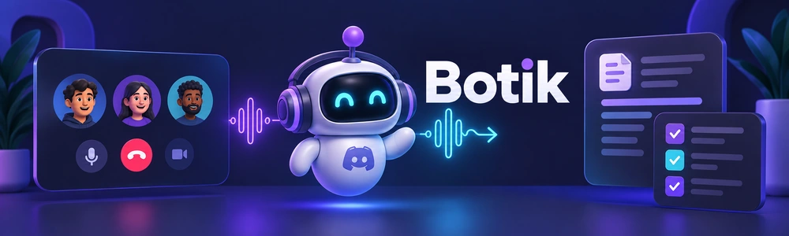

# Botik - Self-hosted Meeting Assistant for Discord

Run Botik on your own server with your own Discord bots and provider credentials.
Record Discord meetings and get a transcript with speaker names and timestamps.
Add live captions, AI summaries and voice answers when you need them.

[Get started](docs/getting-started.md) · [See examples](docs/preview.md) · [Documentation](docs/README.md)

| Summary and attachments | Actions, questions, and recording | Transcript | Recording |
| :---: | :---: | :---: | :---: |
|  |  |  |  |

## What it does

- **Records automatically** when people join the configured voice channel.
- **Posts the full transcript** to Discord after the meeting.
- **Adds optional extras:** live captions, AI notes, voice answers, meeting memory and recording playback.

The default setup includes a transcript and a simple turn-count outline.
AI features and playback need extra configuration; follow the [feature guides](docs/optional-features.md). Original recordings remain
available if transcription or publishing fails.

## Get started

Self-host Botik with two Discord bots and a speech provider key.
Follow the [setup guide](docs/getting-started.md), then run `/setup-voice-bot`
to choose your voice channel and where results appear.

## Learn more

- [Self-hosting scenarios and configuration](docs/self-hosting/README.md)
- [Speech providers and language support](docs/speech-providers.md)
- [Tested capabilities and limitations](infra/deployment/oss-acceptance.md)
- [Development](docs/development.md)
- [Architecture](docs/architecture/overview.md)
